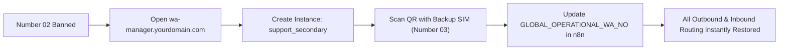

# WhatsApp Routing + ERPNext CRM Cluster

Production deployment guide and architecture for the decoupled, multi-language WhatsApp support pipeline running on Google Cloud Platform (GCP).

---

## 1. Architecture Overview

- **Entry Point (Number 01)**: Official Meta WhatsApp Cloud API. Receives the initial customer touchpoint, handles language selection buttons, and triggers routing.
- **Conversational Engine (Number 02 / Number 03)**: Swappable instances hosted on Evolution API v2. Zero message cost for conversational volume.
- **Evolution Manager UI**: Web dashboard for non-technical managers to create instances and link WhatsApp via QR code.
- **n8n Orchestrator**: Handles Meta webhooks, ERPNext Lead queries, translation calls, and handoff commands.
- **Reverse Proxy**: Caddy v2 providing automatic Let's Encrypt SSL/TLS certificates on ports 80 and 443. All internal services communicate securely across Docker's private bridge network (`cluster_net`).

---

## 2. GCP VM Deployment Guide (Step-by-Step)

### Step 2.1: Provision Google Cloud Compute Instance
1. Go to **GCP Console** -> **Compute Engine** -> **VM instances** -> **Create Instance**.
2. **Machine Configuration**:
   - **Region / Zone**: Choose your nearest region (e.g., `asia-south1` Mumbai).
   - **Machine Type**: `e2-standard-2` (2 vCPU, 8 GB RAM).
3. **Boot Disk**:
   - **OS**: Ubuntu.
   - **Version**: Ubuntu 22.04 LTS (x86/64).
   - **Boot disk type**: Balanced persistent disk.
   - **Size**: 30–50 GB.
4. **Firewall**:
   - Check **Allow HTTP traffic**.
   - Check **Allow HTTPS traffic**.
5. Click **Create**.
6. **Reserve a Static External IP**:
   - Navigate to **VPC network** -> **IP addresses**.
   - Locate the ephemeral IP assigned to your VM, click the menu -> **Promote to static external IP address**.

### Step 2.2: Configure DNS A Records
In your DNS provider (Cloudflare, GoDaddy, Namecheap, etc.), create three **A records** pointing to your VM's Static External IP:

| Subdomain Type | Record Name | Type | Target IP | Proxy Status |
|---|---|---|---|---|
| Evolution API | `wa-gateway.yourdomain.com` | A | `<YOUR_STATIC_GCP_IP>` | DNS Only (Disable Cloudflare proxy if testing ACME) |
| Evolution Manager | `wa-manager.yourdomain.com` | A | `<YOUR_STATIC_GCP_IP>` | DNS Only |
| n8n Orchestrator | `n8n.yourdomain.com` | A | `<YOUR_STATIC_GCP_IP>` | DNS Only |

### Step 2.3: SSH into VM & Install Docker
SSH into your Ubuntu VM via GCP Console or terminal:

```bash
# Update package indices
sudo apt update && sudo apt upgrade -y

# Install prerequisites
sudo apt install -y curl ca-certificates gnupg lsb-release

# Add Docker official GPG key
sudo install -m 0755 -d /etc/apt/keyrings
curl -fsSL https://download.docker.com/linux/ubuntu/gpg | sudo gpg --dearmor -o /etc/apt/keyrings/docker.gpg
sudo chmod a+r /etc/apt/keyrings/docker.gpg

# Add Docker repository
echo \
  "deb [arch=$(dpkg --print-architecture) signed-by=/etc/apt/keyrings/docker.gpg] https://download.docker.com/linux/ubuntu \
  $(lsb_release -cs) stable" | sudo tee /etc/apt/sources.list.d/docker.list > /dev/null

# Install Docker Engine and Docker Compose plugin
sudo apt update
sudo apt install -y docker-ce docker-ce-cli containerd.io docker-buildx-plugin docker-compose-plugin

# Enable and start Docker service
sudo systemctl enable docker
sudo systemctl start docker

# Add your user to the docker group (avoid needing sudo for docker commands)
sudo usermod -aG docker $USER
newgrp docker
```

---

## 3. Deploying the Cluster

### Step 3.1: Copy Project Files to the Server
Clone your repository or upload the files to a dedicated directory on the VM:

```bash
mkdir -p ~/whatsapp-cluster
cd ~/whatsapp-cluster
# Transfer docker-compose.yml, Caddyfile, .env.example into this directory
```

### Step 3.2: Configure `.env`
Copy `.env.example` to `.env`:

```bash
cp .env.example .env
```

Generate secure credentials and edit `.env`:
```bash
# Generate keys
openssl rand -hex 16 # for POSTGRES_PASSWORD
openssl rand -hex 16 # for REDIS_PASSWORD
openssl rand -hex 24 # for AUTHENTICATION_API_KEY
openssl rand -hex 16 # for N8N_ENCRYPTION_KEY
```

Open `.env` in an editor (`nano .env`) and update:
1. `WA_GATEWAY_DOMAIN=wa-gateway.yourdomain.com`
2. `WA_MANAGER_DOMAIN=wa-manager.yourdomain.com`
3. `N8N_DOMAIN=n8n.yourdomain.com`
4. `ACME_EMAIL=your-email@yourdomain.com`
5. Generated passwords for Postgres, Redis, Evolution API, and n8n.
6. `GLOBAL_OPERATIONAL_WA_NO=support_primary`

### Step 3.3: Launch the Stack
```bash
docker compose up -d
```

Check running containers:
```bash
docker compose ps
```

Verify Caddy has acquired SSL certificates:
```bash
docker compose logs -f caddy
```

---

## 4. Evolution Manager & Device Pairing (QR Code)

Once the stack is running and DNS has propagated:

1. Open your browser and navigate to:
   ```
   https://wa-manager.yourdomain.com
   ```
2. **Login Screen**:
   - **Evolution API URL**: Enter `https://wa-gateway.yourdomain.com`
   - **API Key**: Enter the `AUTHENTICATION_API_KEY` defined in `.env`
3. **Create an Instance**:
   - Click **Create Instance** / **New Instance**.
   - Set **Instance Name** to: `support_primary` *(must match `GLOBAL_OPERATIONAL_WA_NO` in `.env`)*.
   - Integration Type: Select **Baileys**.
   - Click **Create**.
4. **Scan QR Code**:
   - The instance card will display a QR code.
   - Open WhatsApp on the mobile device designated as **Number 02**.
   - Go to **Linked Devices** -> **Link a Device**.
   - Scan the QR code displayed on the Evolution Manager screen.
   - The status in Evolution Manager will transition to **Connected** (open).

---

## 5. What to Do If a Number Gets Banned (Zero Downtime Number Swap)

Because Number 02 runs on an unofficial API, WhatsApp may occasionally flag or ban the session if cold outreach rules are violated. The cluster is designed for immediate failover:

1. Open `https://wa-manager.yourdomain.com`.
2. Click **Create Instance** and name it `support_secondary` (or `support_backup`).
3. Scan the new QR code with a backup SIM/device (Number 03).
4. In your n8n workflow or VM `.env`:
   - Change `GLOBAL_OPERATIONAL_WA_NO=support_secondary`.
   - In n8n, the variable updates immediately.
5. All outgoing messages and inbound webhooks switch to the backup number instantly without refactoring any business logic or touching ERPNext.

---

## 6. Manual Setup Checklist

The following items cannot be automated and must be performed in their respective portals:
- [ ] **Meta Cloud API (Number 01)**: Register a Meta Developer account, configure WhatsApp Cloud API, add system phone number, and obtain a Permanent System User Token.
- [ ] **DNS Records**: Point `wa-gateway`, `wa-manager`, and `n8n` to the VM's static IP.
- [ ] **ERPNext CRM**:
  - Generate an API Key & Secret for n8n under an integration user.
  - Add the custom field `custom_preferred_language` on DocType `Lead`.
- [ ] **GCP Cloud Translation / Vertex AI**:
  - Enable Cloud Translation API or Vertex AI API in Google Cloud Console.
  - Create a Service Account with the `Cloud Translation API User` role and download the JSON key.

---

## 7. Google Cloud Translation & Vertex AI Setup Guide

To perform automatic translation between **Tamil** and **English**, you will need to enable Google Cloud Translation or Vertex AI. **Never commit your GCP API keys or service account JSON files to this Git repository.**

### Step 7.1: Enable APIs in Google Cloud Console
1. Log in to [Google Cloud Console](https://console.cloud.google.com/).
2. Select or create your GCP Project (e.g. `whatsapp-support-cluster`).
3. Navigate to **APIs & Services** -> **Library**.
4. Search for and enable:
   - **Cloud Translation API** (`translate.googleapis.com`)
   - *(Optional for Gemini 1.5 Flash)*: **Vertex AI API** (`aiplatform.googleapis.com`)

### Step 7.2: Create Credentials / IAM Service Account

#### Approach A: API Key with API Restrictions (Fastest & Simplest)
1. Go to **APIs & Services** -> **Credentials**.
2. Click **Create Credentials** -> **API Key**.
3. Click **Edit API Key**:
   - Name: `wa-cluster-translation-key`.
   - Under **API restrictions**, select **Restrict key** -> choose **Cloud Translation API**.
4. Copy the generated key and add it to your `.env` file on the VM:
   ```bash
   GCP_TRANSLATION_API_KEY=AIzaSy...
   ```

#### Approach B: IAM Service Account (Enterprise Best Practice)
1. Go to **IAM & Admin** -> **Service Accounts**.
2. Click **Create Service Account**:
   - Name: `wa-translator-sa`.
3. Grant Role:
   - **Cloud Translation API User** (`roles/cloudtranslate.user`).
   - *(If using Vertex AI Gemini Flash)*: **Vertex AI User** (`roles/aiplatform.user`).
4. Click **Done**.
5. Click on the newly created Service Account -> **Keys** tab -> **Add Key** -> **Create new key** (JSON).
6. Transfer the JSON file securely to your GCP VM (e.g., `~/whatsapp-cluster/credentials/gcp-sa.json`) and mount it to the n8n container, or configure the GCP credentials directly in n8n's **Google Cloud** credential manager.

---

## 8. Swapping Operational Numbers After a WhatsApp Ban (Zero Downtime)

Because Evolution API uses WhatsApp's web protocol (Baileys), high-volume cold outreach can result in account bans. To recover in less than 2 minutes with **zero downtime**:



1. Open `https://wa-manager.yourdomain.com`.
2. Click **Create Instance**, name it `support_secondary`, and scan the QR code with your backup WhatsApp phone.
3. In n8n, go to **Variables** (or edit `.env` on your VM and run `docker compose up -d`):
   - Set `GLOBAL_OPERATIONAL_WA_NO=support_secondary`.
4. All workflows (`01-direct-inbound-lead`, `02-language-and-handoff`, `03-inbound-translation`, `04-outbound-translation`) immediately route all messages through `support_secondary`.
